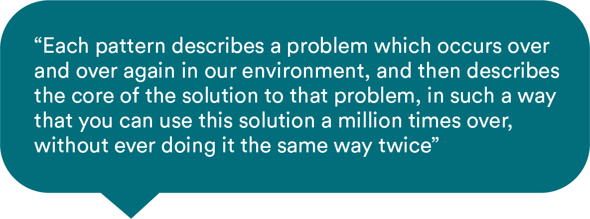
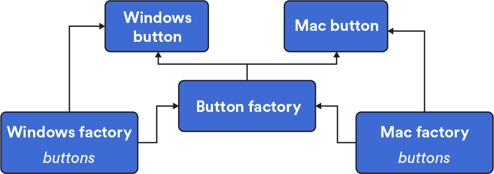

# 

You probably already know this secret about programmers: They love reusing stuff. Frameworks, algorithms, classes — they’re all just things that can be used over and over again to solve similar problems. We also have design patterns: problems that are similar in nature but solved a bit differently every time. Let’s explore them.

## The Origin of Design Patterns

The concept of design patterns can be found throughout programming and software architecture. But it actually comes to us from the world of building architecture; specifically, from architect and author Christopher Alexander.

There are three aspects to any design pattern:

- A **common problem**.
- A **generic, standard solution** to that problem.
- The **many different implementations** of that solution.



## Design Patterns IRL

A simple example of a design pattern that Alexander describes is “a place to wait.”

Here are the three aspects of that pattern:

| Aspect                                                   | A Place to Wait                                                  |
| -------------------------------------------------------- | ---------------------------------------------------------------- |
| **A common problem.**                                    | People need a place to be when they’re waiting for something.    |
| **A generic, standard solution to that problem.**        | A public space with chairs for people to sit in while they wait. |
| **The many different implementations of that solution.** | A bus stop, the waiting room at the dentist, an airport lounge.  |

### Knowledge Check

Identify the design patterns from the options below.

1. Chairs
2. Intersections
3. Carnivals
4. Built-in Furniture
5. Reducing a building's carbon footprint

<br>
<details>
<summary>
Click for answer
</summary>
<br>
Our Answer

2. Intersections
3. Carnivals
4. Built-in Furniture

Design patterns are generic solutions to common problems. Intersections, carnivals, and built-in furniture are all solutions that can be implemented in different ways depending on the situation.

</details>
<br>

## Getting Standard With Our Code

You might be thinking, “More standard problems and solutions?! But we just learned about algorithms!” And you’d be right. Algorithms are indeed standard recipes to solve similar problems; functions do the same thing. Using these tools helps you avoid inefficiency and repetition in your code.

We also have standard ways to solve problems in the form of frameworks, such as React, Angular, Django, and Ruby on Rails. These tools provide structures and make it faster and easier to build websites and applications.

Design patterns in programming sit somewhere in the middle. They don’t solve problems as granularly as algorithms do, but they aren’t as robust as a technical framework like Rails.


## Let’s Get Technical

<a href="https://generalassembly.wistia.com/medias/rn6ssijv6u?wvideo=rn6ssijv6u"></a>

_Transcript_

When we talk about, “here’s how Rails is structured,” it follows what’s called the MVC pattern, or “model-view-controller” pattern. That’s a common design pattern that spans multiple languages and frameworks.

So what’s a design pattern? It’s a step above the formal properties of a particular algorithm and these runtime classes. It’s a way to maintainably structure complicated software or notice that there are common solutions to common problems that you run into over and over again, even though each of the solutions is slightly different every time. It’s really nice to be able to categorize and talk about these basic patterns.

And we teach some of those! So it’s nice to know that these things aren’t just one-off strokes of genius — that there’s a whole family of design patterns. It’s not just MVC; it’s other things that might be useful to bring up.

_end of transcript_

## Design Patterns in Programming

Think of a design pattern as a template or list of best practices for solving a given type of problem. It’s not source code or a finished design, rather a general description of the solution to a problem. Typically, most design patterns explain the relationship and interactions between **classes** and **objects**.

The purposes of design patterns are simple (and pretty compelling):

- To help you better understand and contextualize a problem.
- To reuse a template or solution so you can solve that problem faster.

Design patterns aren’t categorized by a particular domain problem; there’s no design problem for sending a tweet or liking a post on Instagram. Instead, design patterns are concerned with the **technical problems** associated with creating, composing, or organizing the interactions among several objects. Let’s hear more about this on the following slide.

## Design Patterns and the Problems They Solve

<a href="https://generalassembly.wistia.com/medias/o0mey9xs2o?wvideo=o0mey9xs2o"></a>

_Transcript_

If I say, “I want you to implement a quick sort. Quick sort should take an array of anything in JavaScript and implement quick sort,” you can do that; you know exactly what to do.

But if I say, “Implement the command pattern,” your first question should be, “Of what? What domain? What problem am I trying to solve?”

You can’t just implement the pattern and throw stuff into it — you have to give it commands and things to operate in. It’s more domain-specific, and I think that’s why it’s less concrete: because it’s necessarily parasitic on some other kind of content in a way that a lot of the algorithms aren’t.

_end of transcript_

## Types of Design Patterns

Although design patterns are somewhat abstract and aren’t tied to a specific problem or domain, we can still group them based on the broad **types of problems** that they solve. There are three major types, each of which we’ll cover in this lesson:

- **Creational** patterns
- **Structural** patterns
- **Behavioral** patterns

## Creational Patterns

Creational patterns are associated with — you guessed it — the creation of objects and classes. The basic process of creating objects can add complexity and other problems to a design. Using a pattern provides methods that limit that complexity, increase the flexibility of objects, and let you reuse parts of existing code.

A creational pattern can come in handy when...

- The system should be independent of how its objects and products are created.
- A set of related objects is designed to be used together.
- Hiding the implementation of a product and only revealing its interface.

There are two notable creational patterns you might already know: `Abstract Factory` and `Singleton`.

## Creational Patterns: Abstract Factory

`Abstract Factory` allows you to create families of related objects without specifying a concrete class for each object.

Imagine that you’re a clothing designer. You need to build types of clothing (shirts, sweaters, jeans), as well as sizes of clothing (petites, regular, tall). If you were to build them using an `Abstract Factory` pattern, you’d create an interface to build the clothing type (sweater) and another interface to build the size (petites). Those interfaces then work together to generate a petite-sized sweater.

In coding terms? Imagine you’re creating a “submit” button that will be used on Windows and Mac operating systems. The button is the same object with the same functionality, only with a different class (Windows or Mac) depending on the operating system.



## Creational Patterns: Singleton

`Singleton` is a famous, simple, and controversial design pattern that solves a fundamental problem. At its most basic, the `Singleton` pattern restricts a class or object to one instance. This is helpful when you need to control access to a shared resource such as a database or file. `Singleton` also provides “global access” to this single, important object from anywhere in a program. `Singleton` critics would say that it’s overused. It should only be used if an object has exactly one instance, and it’s not meant to replace global variables.

Think about the U.S. government: There’s only one president at a given time, and their term and other responsibilities are determined by another body — Congress. The title “President” makes it obvious who the president is at the time.

Below, we have a simple `Singleton` implementation. By using a closure, the SingleCounter always returns a single instance of the `Counter` class. In this way, different parts of our app can instantiate as many `SingleCounters` as needed while always being able to read and update the shared counter value.

```js
// in single.js:
class Counter {
  constructor() {
    this.counterVal = 0;
    this.name = 'counterA';
  }

  inc() {
    this.counterVal += 1;
    return this.counterVal;
  }

  dec() {
    this.counterVal -= 1;
    return this.counterVal;
  }
}

const instance = new Counter();

class SingleCounter {
  constructor() {
    return instance;
  }
}

module.exports = {
  SingleCounter,
};

// from another local file:
const { SingleCounter } = require('./single');

const firstCounter = new SingleCounter();
const secondCounter = new SingleCounter();

firstCounter.inc();
firstCounter.inc();

console.log(secondCounter.counterVal); // => 2
console.log(firstCounter.counterVal); // => 2

secondCounter.name = 'counterB';
console.log(firstCounter.name); // => counterB
console.log(secondCounter.name); // => counterB
```

## Structural Patterns

Structural design patterns help you understand and work with the relationships between classes and objects. They are methods of organizing different objects and classes into larger structures that provide more functionality while still keeping those structures efficient.

In modern web development, structural design patterns aren’t very common. But you might encounter one type of pattern, the `Decorator`, which makes it possible to dynamically attach responsibilities to an object. This extends functionality without modifying all instances of that object. Think about “decorating” a holiday tree. You start with a plain fir tree and add ornaments, lights, and garlands to make it festive. It’s still recognizable as a fir tree, but the decorations have added new functionalities.

`Decorator`s are used in many languages to abstract away presentation or view logic into manageable units.


## Behavioral Patterns

Behavioral design patterns identify communication patterns between objects and realize those patterns. By determining those patterns, we can increase flexibility and efficiency for associated communications. Of any of the three design pattern categories, behavioral patterns are the most relevant to software engineering today.

Here are some common uses:

- The `Iterator` pattern allows us to traverse collections of elements without worrying about the exact data structures in which they’re contained. What if you have data in a tree, a linked list, and a graph? You might think that you need different traversal methods to check each set for a value. Instead, with the `Iterator` pattern, traversals are stored in a separate object, making the whole process more efficient.
- The `Command` pattern turns a request into a standalone object that contains all of the information related to that request. This makes it easier to set parameters for or delay the request.

## Behavioral Patterns in React

A key aspect of React is unidirectional data flow, or data that flows from a parent component to nested child components. The parent component will have a variable called `state`, which defines your app's state and shares it with its child components.

The `state` object stems from two important design patterns: the `State` and `Visitor` patterns:

- The `State` pattern lets an object alter its behavior when its internal state changes; it will appear to change its class. A `state` class, define upfront, contains the abstract base class, the different states, and the state-specific behaviors. (A `state` object is typically a Singleton!)
- The `Visitor` pattern abstracts an operation to be performed on the elements of an object. You can define a new operation without changing the classes of the elements it's operating on.

## Let’s Talk About Interviews

Interviewers might quiz you on your knowledge of how the different types of patterns are used and the problems they solve. Good news: You probably won’t be asked to code anything related to this topic!

Check out these articles to get started:

- [Interview questions and answers.](https://www.educba.com/design-pattern-interview-questions/)
- [More design pattern questions.](https://dev.to/aershov24/9-unusual-design-patterns-interview-question-with-answers-3gjl)

